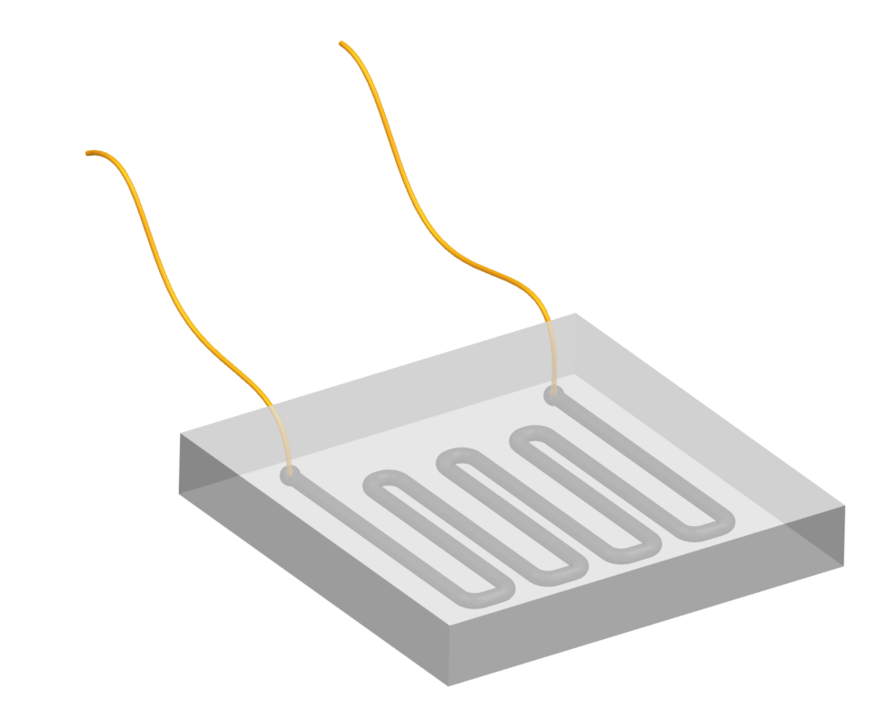

Force Resistive Sensor Design

This project includes the design, manufacturing, and 3D simulation of a soft force resistive sensor. 3D design and mold models are saved in 3D design folder. Molds are 3D printed and Ecoflex 00-30 is used for the base material of the sensor. Conductive carbon ink is injected into the channels which works as the resistive and conductive element of the sensor. Arduino micro is used for the data collection and circuit diagram can be found below (10k resistor is used in the circuit). Gathered data is then send to the Unity by COM Port for 3D simulation of the sensor.

*Example Circuit Set-up;

*3D model of the soft sensor;

*Youtube demonstration;
https://www.youtube.com/watch?v=npRAkrWdMOI
